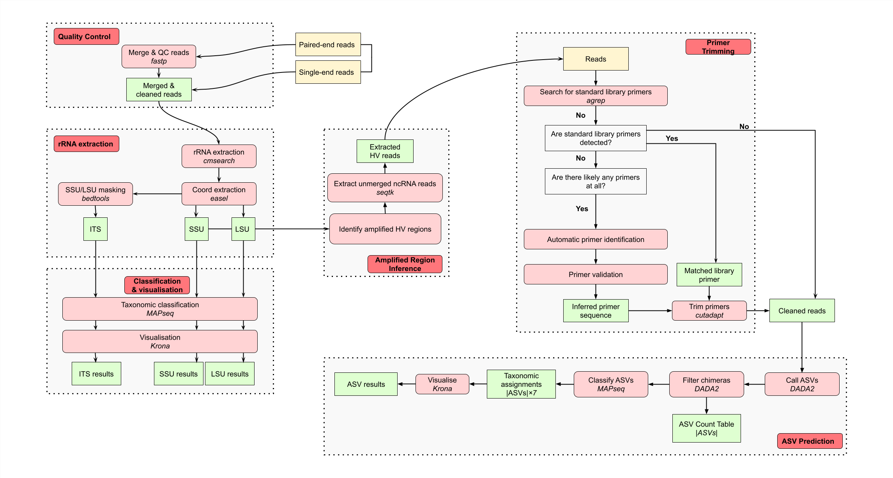

# MGnify amplicon analysis pipeline

This repository contains the **beta version** of the v6.0 [MGnify](https://www.ebi.ac.uk/metagenomics) amplicon analysis pipeline. It is, first and foremost, a refactor of the existing [v5.0 amplicon analysis pipeline](https://github.com/EBI-Metagenomics/pipeline-v5), replacing CWL with [Nextflow](https://www.nextflow.io/) as its workflow management system. This pipeline re-implements all [existing closed-reference v5.0 features](https://docs.mgnify.org/src/docs/analysis.html#amplicon-analysis-pipeline), and makes multiple significant changes and additions.



## Pipeline description

### Features

The amplicon analysis pipeline v6.0 re-implements all of the existing features from v5.0:

- Reads quality control
- rRNA sequence extraction using [Infernal/cmsearch](https://github.com/EddyRivasLab/infernal/tree/master)
- Closed-reference-based taxonomic classification and visualiation of rRNA using [MAPseq](https://github.com/meringlab/MAPseq) and [Krona](https://github.com/marbl/Krona)

The amplicon analysis pipeline v6.0 also contains multiple significant changes:

- Refactoring from CWL to [Nextflow](https://www.nextflow.io/) for pipeline definition
- Simplification the reads quality control using [fastp](https://github.com/OpenGene/fastp)
- Automatic amplified region inference for 16S and 18S rRNA
- Automatic primer identification, trimming, and validation
- Addition of Amplicon Sequence Variant (ASV) calling using [DADA2](https://benjjneb.github.io/dada2/index.html)
- Taxonomic classification and visualisation of ASVs using [MAPseq](https://github.com/meringlab/MAPseq) and [Krona](https://github.com/marbl/Krona) to complement the existing closed-reference analysis
- Addition of [PR2](https://pr2-database.org/) as a reference database
- Updating of existing reference databases ([SILVA](https://www.arb-silva.de/), [UNITE](https://unite.ut.ee/), [ITSoneDB](https://itsonedb.cloud.ba.infn.it), [Rfam](https://rfam.org/))

### Valid amplicons

At this stage, the only sequence amplicons that this pipeline is built for are:

| Amplicon 	| Closed-reference analysis 	| ASV analysis 	|
|:--------:	|:-------------------------:	|:------------:	|
|    16S   	|             ✓             	|       ✓      	|
|    18S   	|             ✓             	|       ✓      	|
|    LSU   	|             ✓             	|       ✗      	|
|    ITS   	|             ✓             	|       ✗      	|


### Tools

| Tool                      	| Version  	| Purpose                                                	|
|---------------------------	|----------	|--------------------------------------------------------	|
| [fastp](https://github.com/OpenGene/fastp)                     	| 0.23.4   	| Read quality control                                   	|
| [seqtk](https://github.com/lh3/seqtk)                     	| 1.3-r106 	| FASTQ file manipulation                                	|
| [easel](https://github.com/EddyRivasLab/easel)                     	| 0.49     	| FASTA file manipulation                                	|
| [bedtools](https://bedtools.readthedocs.io/en/latest/)                  	| 2.30.0   	| FASTA sequence masking                                 	|
| [Infernal/cmsearch](https://github.com/EddyRivasLab/infernal/tree/master)                  	| 1.1.5    	| rRNA sequence searching                                	|
| [cmsearch_tblout_deoverlap](https://github.com/nawrockie/cmsearch_tblout_deoverlap/tree/master) 	| 0.09     	| Deoverlapping of cmsearch results                      	|
| [MAPseq](https://github.com/meringlab/MAPseq)                    	| 2.1.1b   	| Reference-based taxonomic classification of rRNA       	|
| [Krona](https://github.com/marbl/Krona)                    	| 2.8.1    	| Krona chart visualisation                              	|
| [cutadapt](https://cutadapt.readthedocs.io/en/stable/)                  	| 4.6      	| Primer trimming                                        	|
| [R](https://www.r-project.org/)                         	| 4.3.3    	| R programming language (runs DADA2)                    	|
| [DADA2](https://benjjneb.github.io/dada2/index.html)                     	| 1.30.0   	| ASV calling                                            	|
| [mgnify-pipelines-toolkit](https://github.com/EBI-Metagenomics/mgnify-pipelines-toolkit)  	| 0.1.8    	| Toolkit containing various in-house processing scripts 	|

### Reference databases

This pipeline uses five different reference databases. The files the pipeline uses are processed from the raw files available on each database's website, for use by MAPseq and cmsearch. We provide ready-made versions of these processed files on our FTP, which you can find here:

| Reference database 	| Version 	| Purpose                               	| Processed file paths                                                                                                                                          	|
|--------------------	|---------	|---------------------------------------	|---------------------------------------------------------------------------------------------------------------------------------------------------------------	|
| [SILVA](https://www.arb-silva.de/)              	| 138.1   	| 16S+18S+LSU rRNA database                 	| https://ftp.ebi.ac.uk/pub/databases/metagenomics/pipelines/tool-dbs/silva-ssu/ https://ftp.ebi.ac.uk/pub/databases/metagenomics/pipelines/tool-dbs/silva-lsu/ 	|
| [PR2](https://pr2-database.org/)                	| 5.0     	| Protist-focused 18S+16S rRNA database 	| https://ftp.ebi.ac.uk/pub/databases/metagenomics/pipelines/tool-dbs/pr2/                                                                                      	|
| [UNITE](https://unite.ut.ee/)              	| 9.0     	| ITS database                          	| https://ftp.ebi.ac.uk/pub/databases/metagenomics/pipelines/tool-dbs/unite/                                                                                    	|
| [ITSoneDB](https://itsonedb.cloud.ba.infn.it)           	| 1.141   	| ITS database                          	| https://ftp.ebi.ac.uk/pub/databases/metagenomics/pipelines/tool-dbs/itsonedb/                                                                                 	|
| [Rfam](https://rfam.org/)               	| 14.10   	| RNA family profile database           	| https://ftp.ebi.ac.uk/pub/databases/metagenomics/pipelines/tool-dbs/rfam/                                                                                     	|

## How to run

### Requirements

At the moment the only prerequisites for running it are Nextflow and [Docker](https://www.docker.com/)/[Singularity](https://docs.sylabs.io/guides/3.5/user-guide/introduction.html), since all of the Nextflow processes use pre-built containers.

### Input shape

The input data for the pipeline is amplicon sequencing reads (either paired-end or single-end) in the form of FASTQ files. These files should be specified using a `.csv` samplesheet file with this format:

```
sample,fastq_1,fastq_2,single_end
SRR9674618,/path/to/reads/SRR9674618.fastq.gz,,true
SRR17062740,/path/to/reads/SRR17062740_1.fastq.gz,/path/to/reads/SRR17062740_2.fastq.gz,false
```

### Execution

You can run the current version of the pipeline on SLURM like this:

```bash
nextflow run ebi-metagenomics/amplicon-pipeline \
    -r main \
    -profile codon_slurm \
    --input /path/to/samplesheet.csv \
    --outdir /path/to/outputdir
```

## Outputs

### Output directory structure

Example output directory structure for one run (`ERR4334351`):
```
├── pipeline_info
│   └── software_versions.yml
├── ERR4334351
│   ├── taxonomy-summary
│   │   ├── UNITE
│   │   │   ├── ERR4334351_UNITE.txt
│   │   │   ├── ERR4334351_UNITE.tsv
│   │   │   ├── ERR4334351_UNITE.mseq
│   │   │   └── ERR4334351.html
│   │   ├── SILVA-SSU
│   │   │   ├── ERR4334351_SILVA-SSU.txt
│   │   │   ├── ERR4334351_SILVA-SSU.tsv
│   │   │   ├── ERR4334351_SILVA-SSU.mseq
│   │   │   └── ERR4334351.html
│   │   ├── PR2
│   │   │   ├── ERR4334351_PR2.txt
│   │   │   ├── ERR4334351_PR2.tsv
│   │   │   ├── ERR4334351_PR2.mseq
│   │   │   └── ERR4334351.html
│   │   ├── ITSoneDB
│   │   │   ├── ERR4334351_ITSoneDB.txt
│   │   │   ├── ERR4334351_ITSoneDB.tsv
│   │   │   ├── ERR4334351_ITSoneDB.mseq
│   │   │   └── ERR4334351.html
│   │   ├── DADA2-SILVA
│   │   │   ├── ERR4334351_DADA2-SILVA.mseq
│   │   │   ├── ERR4334351_16S-V3-V4.html
│   │   │   └── ERR4334351_16S-V3-V4_DADA2-SILVA_asv_krona_counts.txt
│   │   └── DADA2-PR2
│   │       ├── ERR4334351_DADA2-PR2.mseq
│   │       ├── ERR4334351_16S-V3-V4.html
│   │       └── ERR4334351_16S-V3-V4_DADA2-PR2_asv_krona_counts.txt
│   ├── sequence-categorisation
│   │   ├── ERR4334351.tblout.deoverlapped
│   │   ├── ERR4334351_SSU_rRNA_bacteria.RF00177.fa
│   │   ├── ERR4334351_SSU_rRNA_archaea.RF01959.fa
│   │   └── ERR4334351_SSU.fasta
│   ├── qc
│   │   ├── ERR4334351_suffix_header_err.json
│   │   ├── ERR4334351_seqfu.tsv
│   │   ├── ERR4334351_multiqc_report.html
│   │   ├── ERR4334351.merged.fastq.gz
│   │   └── ERR4334351.fastp.json
│   ├── primer-identification
│   │   ├── ERR4334351_primer_validation.tsv
│   │   ├── ERR4334351_primers.fasta
│   │   └── ERR4334351.cutadapt.json
│   ├── asv
│   │   ├── 16S-V3-V4
│   │   │   └── ERR4334351_16S-V3-V4_asv_read_counts.tsv
│   │   ├── ERR4334351_dada2_stats.tsv
│   │   ├── ERR4334351_DADA2-SILVA_asv_tax.tsv
│   │   ├── ERR4334351_DADA2-PR2_asv_tax.tsv
│   │   └── ERR4334351_asv_seqs.fasta
│   └── amplified-region-inference
│       ├── ERR4334351.tsv
│       └── ERR4334351.16S.V3-V4.txt
├── study_multiqc_report.html
├── qc_passed_runs.csv
├── qc_failed_runs.csv
├── primer_validation_summary.json
└── manifest.json
```

### Top-level reports

#### MultiQC

The pipeline generates two [MultiQC](https://seqera.io/multiqc/) reports: one per-study (`study_multiqc_report.html`), and one per-run (`qc/${id}_multiqc_report.html`). These reports aggregate a few QC statistics from some of the tools run by the pipeline, including:
- fastp
- cutadapt
- DADA2 (as a custom report)

#### QC failed runs

The pipeline runs a couple of sanity and QC checks on every input run. In the case where a run fails, it will be added to a top-level report (`qc_failed_runs.csv`) that aggregates the IDs of any other run that failed, along with the particular reason it failed. For example:

```
ERR6093685,no_reads
ERRSFXHDFAIL,sfxhd_fail
ERRSEQFUFAIL,seqfu_fail
SRRLIBSTRATFAIL,libstrat_fail
```

The different exclusion messages are:

| Exclusion message 	|                                                                                         Description                                                                                        	|
|:-----------------:	|:------------------------------------------------------------------------------------------------------------------------------------------------------------------------------------------:	|
| `seqfu_fail`        	| Run had an error after running `seqfu check`. Check the log file in `qc/${id}_seqfu.tsv` for the exact reason                                                                             	|
| `sfxhd_fail`        	| Run had an error related to the suffix of the file `_1/_2` not matching the headers inside the fastq file. Check the log file in `qc/${id}_suffix_header_err.json` for the reads at fault 	|
| `libstrat_fail`     	| Run was predicted to likely not be of AMPLICON sequencing based on base-conservation patterns at the beginning of reads                                                                   	|
| `no_reads`          	| Run had no reads left after running `fastp`                                                                                                                                               	|

#### QC passed runs

Similarly to runs that fail QC, runs that pass QC are guaranteed to generate results. The IDs of such runs is aggregated into a top-level file (`qc_passed_runs.csv`). For example:

```
SRR17062740,all_results
ERR4334351,all_results
ERRNOASVS,no_asvs
```

An important thing to note is that while a run might succeed at generating results for the closed-reference based method, it might fail at some extra QC checks required for generating results using the ASV method. For this reason, there are two statuses a passed run can have:

- `all_results` - if results for both methods could be generated
- `no_asvs` - if ASV results could not be generated

#### Primer validation summary

The pipeline performs inferrence of primer presence and sequence. For any runs where a primer was detected, metadata about it will be aggregated into a top-level primer validation summary file (`primer_validation_summary.json`), including its sequence, region, and identification strategy. For example:

```json
[
    {
        "id": "SRR17062740",
        "primers": [
            {
                "name": "F_auto",
                "region": "V4",
                "strand": "fwd",
                "sequence": "ATTCCAGCTCCAATAG",
                "identification_strategy": "auto"
            },
            {
                "name": "R_auto",
                "region": "V4",
                "strand": "rev",
                "sequence": "GACTACGATGGTATNTAATC",
                "identification_strategy": "auto"
            }
        ]
    },
    {
        "id": "ERR4334351",
        "primers": [
            {
                "name": "341F",
                "region": "V3",
                "strand": "fwd",
                "sequence": "CCTACGGGNGGCWGCAG",
                "identification_strategy": "std"
            },
            {
                "name": "805R",
                "region": "V4",
                "strand": "rev",
                "sequence": "GACTACHVGGGTATCTAATCC",
                "identification_strategy": "std"
            }
        ]
    }
]
```

The value of the `identification_strategy` key can either be:

- `std` - Meaning the primer was matched to one of the standard library primers (more reliable)
- `auto` - Meaning the primer was automatically predicted (less reliable)